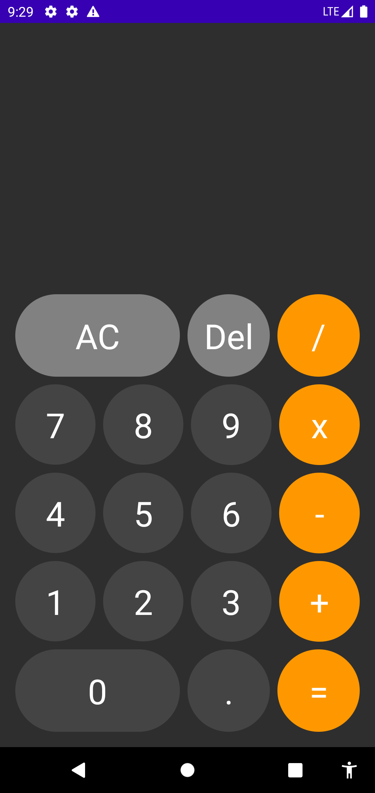
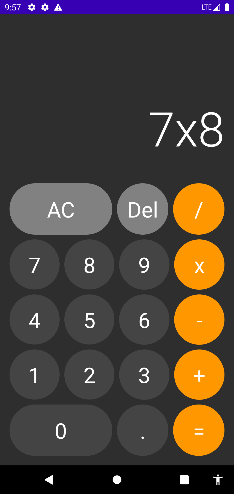

# Compose Calculator

This is a calculator made with JetPack Compose. It is a short example to get started in JetPack Compose. 

- JetPack Compose
- Events
- States
- ViewModel

* [Compose Calculator](app/src/main/java/com/example/composecalculator)
* [Reference](https://www.youtube.com/watch?v=-aTcFJWxEQA)

|Screen Empty|Screen Operation|
|------|------|
|||